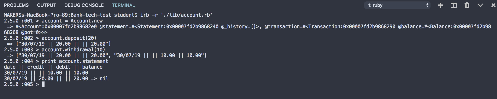

# Bank Tech Test

The app simulates the functionalities of a common bank account where the user can: 
- deposit & withdrawal

## How to use it

* To use the software clone this repository on your local machine. Run `bundle install` to install the dependencies.
* To run tests type on the cmd line `rspec`
* To run the app type on the cmd line `irb -r './lib/account.rb'`
* Type `Account.new` and equal it to a variable `account`
* Use the methods `deposit` and `withdrawal` passing the ammount of money you intend to transfer as `account.deposit(20)`
* Use the method `statement` to print the statement. Use print before calling the method as `print account.statement`
* the output format looks as the example below:
```
date || credit || debit || balance
14/01/2012 || || 500.00 || 2500.00
13/01/2012 || 2000.00 || || 3000.00
10/01/2012 || 1000.00 || || 1000.00
```
## Example of usage


